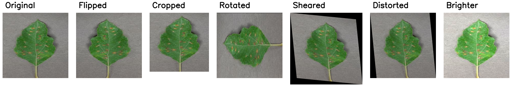
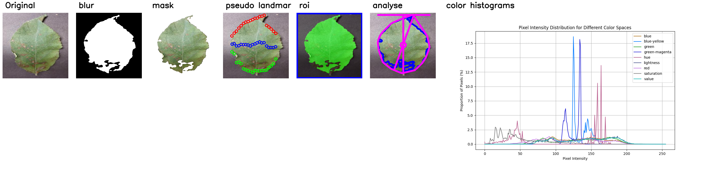

# DataScience X Logistic Regression

42 School Project


## Introduction

The Goal of this Computer Vision project is to classify 2 types of plant with different diseases using a Convolutional Neural Network (CNN) model


### Installation

```bash
python -m venv .venv
source .venv/bin/activate
pip install -r requirements.txt
```

```bash
make
```

### Usage

#### Part I

```bash
python3 Distribution.py -d data/images/leaves
```

#### Part II

```bash
python3 Augmentation.py --folder data/images/leaves
```

#### Part III

- Visualize possible transformations of a single image
```bash
python3 Transformation.py <image_path>
```

- To apply specific transformations to all images in a folder
```bash
python3 Transformation.py -src data/images/leaves -dst data/images/processed -mask -analyse
```

#### Part IV

- Train the model
```bash
python3 Train.py -d data/leaves/images -n <model_name> -e <epoch_number> -b <batch_size> -s <seed> -v <percents_of_validation_data> -a <augment_data_images_per_class>
```

- Predict the class of an image
```bash
python3 predict.py -i <image_path> -m <model_name>
```

## Data Exploration

### Data Analysis

The dataset contains the following plant categories :
- Apple (healthy)
- Apple (black rot)
- Apple (rust)
- Apple (scab)
- Grape (black rot)
- Grape (esca)
- Grape (healthy)
- Grape (spot)


### Data Visualization

#### Distribution

The script `Distribution.py` shows histograms for all the categories of the dataset


This allows us to target specific categories that are under represented in the dataset and apply data augmentation to balance the dataset

#### Augmentation

The script `Augmentation.py` shows the result of possible augmentations for the dataset



We can specify a limit for the number of generated image in order to balance the dataset with the flag `--limit`

#### Transformation

The script `Transformation.py` shows the result of possible transformations for a single image when no `-src` flag is provided



- A binary mask is generated with the otsu thresholding method to isolate the leaf from the background
- A ROI (Region of Interest) is generated to crop the leaf from the image
- The leaf is analyzed with plantCV to extract its characteristics (area, perimeter, width, height, etc.)
- An histogram is provided to show the image color distribution of different color spaces (RGB, HSV and LAB)

When the `-src` flag is provided, the script applies the transformations to all images in the folder and saves the results in the destination folder
The available transformations are :
- Blur (gaussian blur applied to binary mask) `-blur`
- Masking (binary mask applied) `-mask`
- Pseudo Landmarks (shape analysis independant of the plant size) `-pseudolandmarks`
- ROI (Region of Interest applied) `-roi`
- Analysis (size and shape, applied on the ROI mask) `-analyse`
- Color Histogram (RGB, HSV and LAB histograms) `-color`

The `-dst` flag is used to specify the destination folder for the transformed images and all the transformations can be applied with the `-all` flag


## Classification

### Model Training
For the training of our model, we start by augmenting the data. We set a threshold of images per class. Classes that do not have as many images as required are augmented using [Augmentation](####Augmentation) functions. Classes that have more images than the threshold are reduced by removing images until the threshold is reached. All images are then transformed using the mask [Transformation](####Transformation) function to remove the background of the image, which can influence the model.

Our model is built with TensorFlow, using 5 different types of layers:
- **Input**: This layer serves as the entry point for the data. It specifies the shape of the input data, for example, images of 256x256 pixels with 3 channels (RGB).
- **Conv2D**: This layer applies a convolution that helps extract features from the images.
- **MaxPooling2D**: This layer reduces the dimensionality of each feature map while retaining the most important features. It is used to reduce overfitting and improve the efficiency of the model.
- **Flatten**: This layer flattens the data into a vector so that it can be processed by dense layers.
- **Dense**: This layer connects each input to every output through a set of weights. It is generally used to classify the extracted features into the final classes.

Our model is composed as follows:
- 1 Input layer
- 1 Conv2D / MaxPooling2D layer with 16 neurons
- 1 Conv2D / MaxPooling2D layer with 32 neurons
- 1 Conv2D / MaxPooling2D layer with 64 neurons
- 1 Flatten layer
- 1 Dense layer with 128 neurons
- 1 Dense layer with as many neurons as there are different classes

After the augmentation and transformation of the images, our model is trained with the following hyperparameters:
- **epochs**: The number of epochs represents the number of times the entire dataset is passed through the neural network during training.
- **batch_size**: The batch size determines the number of data samples processed before the model updates its internal parameters.
- **number of images per class**
- **seed**: The random seed is used to ensure the reproducibility of the training results. It ensures that the random selections in the training process can be reproduced.


### Model Evaluation


## For correction 

```bash
python3 predict.py -i data/test_images/Unit_test1/Apple_Black_rot1.JPG  -m models/vic_E3-B8-A1300T.keras
python3 predict.py -i data/test_images/Unit_test1/Apple_healthy1.JPG  -m models/vic_E3-B8-A1300T.keras
python3 predict.py -i data/test_images/Unit_test1/Apple_healthy2.JPG  -m models/vic_E3-B8-A1300T.keras
python3 predict.py -i data/test_images/Unit_test1/Apple_rust.JPG  -m models/vic_E3-B8-A1300T.keras      
python3 predict.py -i data/test_images/Unit_test1/Apple_scab.JPG  -m models/vic_E3-B8-A1300T.keras      

python3 predict.py -i data/test_images/Unit_test2/Grape_Black_rot1.JPG  -m models/vic_E3-B8-A1300T.keras
python3 predict.py -i data/test_images/Unit_test2/Grape_Black_rot2.JPG  -m models/vic_E3-B8-A1300T.keras
python3 predict.py -i data/test_images/Unit_test2/Grape_Esca.JPG  -m models/vic_E3-B8-A1300T.keras   
python3 predict.py -i data/test_images/Unit_test2/Grape_healthy.JPG  -m models/vic_E3-B8-A1300T.keras
python3 predict.py -i data/test_images/Unit_test2/Grape_spot.JPG  -m models/vic_E3-B8-A1300T.keras
```
