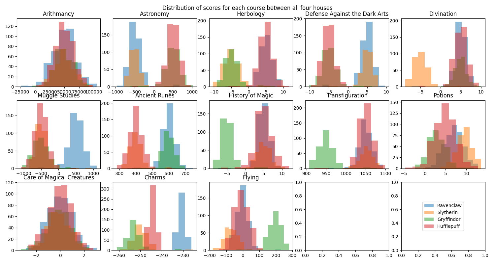
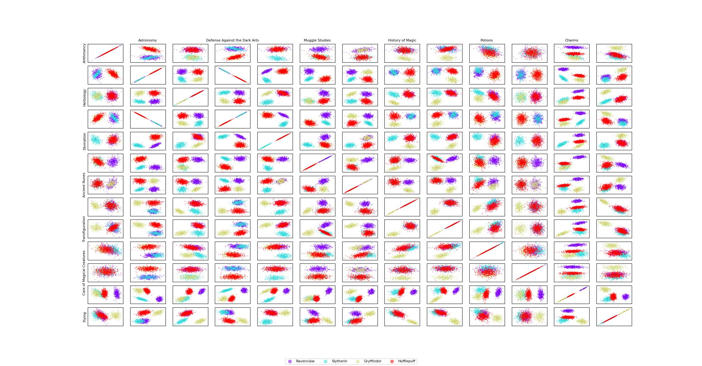
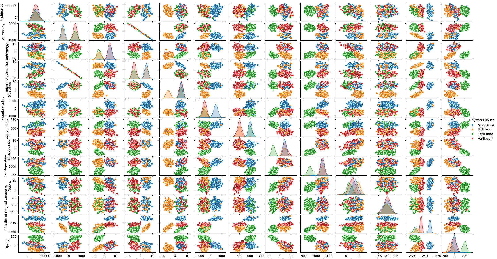

# DataScience X Logistic Regression

## For correction 

python3 predict.py --i data/test_images/Unit_test1/Apple_Black_rot1.JPG  -m first_saved_model.keras
python3 predict.py --i data/test_images/Unit_test1/Apple_healthy1.JPG  -m first_saved_model.keras
python3 predict.py --i data/test_images/Unit_test1/Apple_healthy2.JPG  -m first_saved_model.keras
python3 predict.py --i data/test_images/Unit_test1/Apple_rust.JPG  -m first_saved_model.keras      
python3 predict.py --i data/test_images/Unit_test1/Apple_scab.JPG  -m first_saved_model.keras      

python3 predict.py --i data/test_images/Unit_test2/Grape_Black_rot1.JPG  -m first_saved_model.keras
python3 predict.py --i data/test_images/Unit_test2/Grape_Black_rot2.JPG  -m first_saved_model.keras
python3 predict.py --i data/test_images/Unit_test2/Grape_Esca.JPG  -m first_saved_model.keras   
python3 predict.py --i data/test_images/Unit_test2/Grape_healthy.JPG  -m first_saved_model.keras
python3 predict.py --i data/test_images/Unit_test2/Grape_spot.JPG  -m first_saved_model.keras


## Introduction

In this project, we will be using the Logistic Regression algorithm to predict the likelihood of a student belonging to an Hogwarts House based on their grades and other features  
This first part of the project is focused on the data exploration and cleaning process : We will create several visualizations to understand the dataset and outline the features that will be used in the model  

In the second part we will build a logistic regression model, trained on the training dataset, and evaluate its performance on the test dataset. We will also use the model to predict the house of a list of students.


### Installation

```bash
python -m venv .venv
source .venv/bin/activate
pip install -r requirements.txt
```

### Usage

- training : `python logreg_train.py`
- prediction : `python logreg_predict.py`


## Data Exploration

### Data Analysis

The training dataset contains 19 features and 1600 rows. The features are the following: 
- Index
- Hogwarts House
- First Name
- Last Name
- Birthday
- Best Hand
- Arithmancy
- Astronomy
- Herbology
- Defense Against the Dark Arts
- Divination
- Muggle Studies
- Ancient Runes
- History of Magic
- Transfiguration
- Potions
- Care of Magical Creatures
- Charms
- Flying

The script `describe.py` takes a dataset as parameter and shows basic statistics about the numerical features of the dataset : 
- Count : number of records
- Mean : `sum(x) / n`
- Standard deviation : dispersion measurements of data samples = `sqrt(sum((x - x_mean)^2)/n)`
- Minimum 
- 25th percentile 
- 50th percentile
- 75th percentile
- Maximum

It outputs a list of non numerical features found in the dataset  


### Data Visualization

#### Histograms

The script `histograms.py` shows histograms for all the numerical features of the dataset

This visualization allows us to answer the following question : `Which Hogwarts course has a homogeneous score distribution between all four houses?` 



#### Scatter Plots

The script `scatter_plot.py` shows scatter plots for all the numerical features of the dataset
It allows us to answer the following question : `What are the two features that are similar ?`



#### Pair Plots

The script `pair_plot.py` shows pair plots for all the numerical features of the dataset
It allows us to answer the final question : `what features are you going to use for your logistic regression?`



### Data Cleaning

We selected the following features for our logistic regression model :
- Arithmancy
- Astronomy
- Herbology
- Divination
- Muggle Studies
- Ancient Runes
- History of Magic
- Transfiguration
- Potions
- Charms
- Flying


We choosed to remove :
- All non numerical features
- The course `Care for Magical Creatures` from the features because the distribution is homogenous 
between the houses and it would not help the model to differentiate between the houses  
- The course `Defense Against the Dark Arts` because its distribution is similar to the one of `Astronomy` (we only keep one of the two similar features)

We also completed the dataset the mean of each feature for the missing values because the dataset was lacking  


## Logistic Regression

### Model Training

- The model is trained using logistic regression on the training dataset for each house in the style of one vs all : 
    - For each house, the model is trained to predict the likelihood of a student belonging to this house (0 is unlikely and 1 is likely)
    - The model determines what house is the most likely for a student based on the highest likelihood of all houses
- The gradient descent algorithm is used to minimize the cost function and find the optimal weights for the model
- The script `logreg_train.py` trains the model and stores the weights for each feature for each house in the file `data/weights.npy`

> The accuracy given in the training phase is an indication a the "fitting" of our model and does not represents the real accuracy of a prediction on a test dataset  


### Model Evaluation

- The `data/dataset_test.csv` file contains a test dataset of 400 entries, missing the house of the students
- The script `logreg_predict.py`, retrieves the weights from the file `data/weights.npy` and predicts the house of the students in the test dataset. The predictions are stored in the file `houses.csv`
