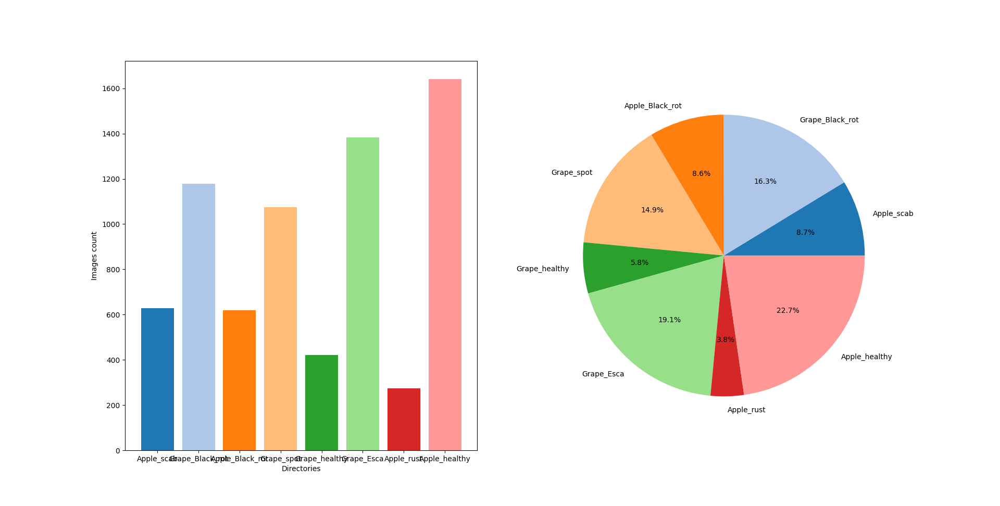

# DataScience X Logistic Regression

42 School Project

## For correction 

python3 predict.py --i data/test_images/Unit_test1/Apple_Black_rot1.JPG  -m first_saved_model.keras
python3 predict.py --i data/test_images/Unit_test1/Apple_healthy1.JPG  -m first_saved_model.keras
python3 predict.py --i data/test_images/Unit_test1/Apple_healthy2.JPG  -m first_saved_model.keras
python3 predict.py --i data/test_images/Unit_test1/Apple_rust.JPG  -m first_saved_model.keras      
python3 predict.py --i data/test_images/Unit_test1/Apple_scab.JPG  -m first_saved_model.keras      

python3 predict.py --i data/test_images/Unit_test2/Grape_Black_rot1.JPG  -m first_saved_model.keras
python3 predict.py --i data/test_images/Unit_test2/Grape_Black_rot2.JPG  -m first_saved_model.keras
python3 predict.py --i data/test_images/Unit_test2/Grape_Esca.JPG  -m first_saved_model.keras   
python3 predict.py --i data/test_images/Unit_test2/Grape_healthy.JPG  -m first_saved_model.keras
python3 predict.py --i data/test_images/Unit_test2/Grape_spot.JPG  -m first_saved_model.keras


## Introduction

The Goal of this Computer Vision project is to classify 2 types of plant with different diseases using a Convolutional Neural Network (CNN) model


### Installation

```bash
python -m venv .venv
source .venv/bin/activate
pip install -r requirements.txt
```

```bash
make
```

### Usage

#### Part I

```bash
python3 Distribution.py -d data/images/leaves
```

#### Part II

```bash
python3 Augmentation.py --folder data/images/leaves
```

#### Part III

- Visualize possible transformations of a single image
```bash
python3 Transformation.py <image_path>
```

- To apply specific transformations to all images in a folder
```bash
python3 Transformation.py -src data/images/leaves -dst data/images/processed -mask -analyse
```

#### Part IV

- Train the model
```bash
python3 Train.py -d data/leaves/images -n <model_name> --e <epoch_number> --b <batch_size>
```

- Predict the class of an image
```bash
python3 Predict.py -i <image_path> -m <model_name>
```

## Data Exploration

### Data Analysis

The dataset contains the following plant categories :
- Apple (healthy)
- Apple (black rot)
- Apple (rust)
- Apple (scab)
- Grape (black rot)
- Grape (esca)
- Grape (healthy)
- Grape (spot)


### Data Visualization

#### Distribution

The script `Distribution.py` shows histograms for all the categories of the dataset



This allows us to target specific categories that are under represented in the dataset and apply data augmentation to balance the dataset

#### Augmentation

The script `Augmentation.py` shows the result of possible augmentations for the dataset


We can specify a limit for the number of generated image in order to balance the dataset with the flag `--limit`

#### Transformation

The script `Transformation.py` shows the result of possible transformations for a single image when no `-src` flag is provided


### Data Cleaning

We selected the following features for our logistic regression model :
- Arithmancy
- Astronomy
- Herbology
- Divination
- Muggle Studies
- Ancient Runes
- History of Magic
- Transfiguration
- Potions
- Charms
- Flying


We choosed to remove :
- All non numerical features
- The course `Care for Magical Creatures` from the features because the distribution is homogenous 
between the houses and it would not help the model to differentiate between the houses  
- The course `Defense Against the Dark Arts` because its distribution is similar to the one of `Astronomy` (we only keep one of the two similar features)

We also completed the dataset the mean of each feature for the missing values because the dataset was lacking  


## Logistic Regression

### Model Training

- The model is trained using logistic regression on the training dataset for each house in the style of one vs all : 
    - For each house, the model is trained to predict the likelihood of a student belonging to this house (0 is unlikely and 1 is likely)
    - The model determines what house is the most likely for a student based on the highest likelihood of all houses
- The gradient descent algorithm is used to minimize the cost function and find the optimal weights for the model
- The script `logreg_train.py` trains the model and stores the weights for each feature for each house in the file `data/weights.npy`

> The accuracy given in the training phase is an indication a the "fitting" of our model and does not represents the real accuracy of a prediction on a test dataset  


### Model Evaluation

- The `data/dataset_test.csv` file contains a test dataset of 400 entries, missing the house of the students
- The script `logreg_predict.py`, retrieves the weights from the file `data/weights.npy` and predicts the house of the students in the test dataset. The predictions are stored in the file `houses.csv`
